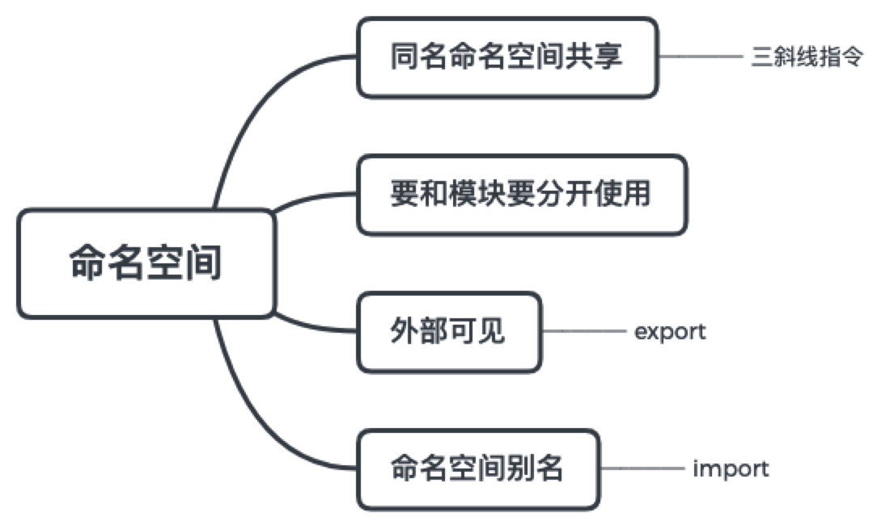

命名空间可以有效的避免全局污染，在`es6`引入模块系统之后，命名空间很少在提及了。

在命名空间内可以定义任意多的变量，这些变量只能在命名空间下可见，如果想要这些成员在全局空间下都可见的话，就需要使用`export`关键字把它导出

```ts
namespace Shape{
  const pi = Math.PI
  export function cricle(r: number){
    return pi * r ** 2
  }
}
```

在不同的文件中是同一个命名空间，它们之间是会共享的。

命名空间不要和模块混用，最好在全局的环境下使用，通过`script`标签来引入

如果在两个文件中使用了同一个命名空间，在一个文件中访问另一个命名空间的定义的方法时，会报错

在使用命名空间时，每次都要写前缀，有时候需要简便，可以对命名空间取一个别名，这样访问就更加快捷了

```ts
import circle = Shape.circle
```

在`ts`早期版本中，命名空间也叫做内部模块，本质上就是一个闭包，可以用于隔离作用域，随着`es6`模块的引入，内部模块这个名称现在已经不在叫了，`ts`保留了命名空间，更多的考虑是对全局时代的一种兼容，现在在一个完全模块化的系统中，可以不必使用命名空间