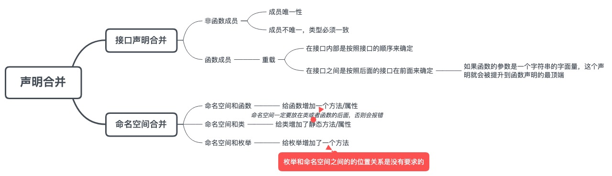

## 接口声明合并

在编写的时候，如果是一个全局模块的话，这两个接口可以不再同一个文件中，也能发生接口的合并。

### 非函数成员

对于接口中非函数成员，要保证它的唯一性，如果不唯一的话，它们类型必须相同。

```ts
interface A {
  x: number
  y: string       // 报错
}
interface A {
  y: number
}
```

```ts
interface A {
  x: number
  y: number       // 不报错
}
interface A {
  y: number
}
```

### 函数成员

对于函数成员，每一个函数都会被声明为一个函数重载。在实现接口时，函数需要更加宽泛。

```ts
interface A {
  x: number
  foo (bar: number): number
}
interface A {
  y: number
  foo (bar: string): string
  foo (bar: number[]): number[]
}
let a: A = {
  x: 1,
  y: 2,
  foo(bar: any) {
      return bar
  }
}
```

函数重载要注意函数声明的顺序，因为编译器会按照顺序进行匹配，那么在接口合并时，这些顺序是如何确定的呢？

有一个原则：
 
 1. 在接口内部是按照接口的顺序来确定，
 2. 在接口之间是按照后面的接口在前面来确定

```ts
interface A {
  x: number
  foo (bar: number): number           // 3
}
interface A {
  y: number
  foo (bar: string): string           // 1
  foo (bar: number[]): number[]       // 2
}
```

如果函数的参数是一个字符串的字面量，这个声明就会被提升到函数声明的最顶端。

```ts
interface A {
  x: number
  foo (bar: number): number        // 5
  foo (bar: 'a'): number           // 2
}
interface A {
  y: number
  foo (bar: string): string        // 3
  foo (bar: number[]): number[]    // 4
  foo (bar: 'b'): number           // 1
}
```

## 命名空间之间的声明合并

在命名空间中导出的成员是不可以重复定义的。

### 命名空间和函数之间的声明合并

命名空间和函数之间的声明合并，相当于给这个函数增加了一个是属性或方法

```ts
function Lib() {}
namespace Lib {
  export let version = '1.0'
}
```

### 命名空间和类之间的声明合并

命名空间和类之间的声明合并，相当于给类增加了一个静态属性或静态属性

```ts
class C {}
namespace C {
  export let state = 1
}
```

### 命名空间和枚举之间的声明合并

命名空间和枚举之间的声明合并，相当于给这个枚举类型增加了一个方法

```ts
enum Color {
  Red,
  Yellow,
  Bule
}
namespace Color {
  export function mix() {}
}
```

命名空间在合函数或者类进行声明合并时，需要注意：命名空间一定要放在类或者函数的后面，否则会报错；而枚举和命名空间之间的的位置关系是没有要求的。